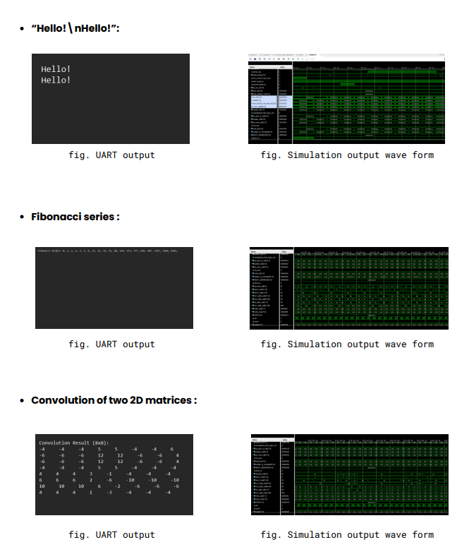
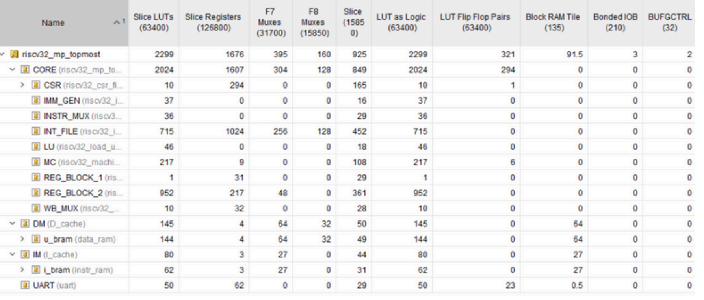

# RISC-V 32-bit 3-Stage Pipelined Microprocessor

<p align="center">


</p>

---

# Table of Contents

- [Overview](#overview)
- [Features](#features)
- [Processor Architecture](#processor-architecture)
- [Pipeline Organization](#pipeline-organization)
- [Processor Modules](#processor-modules)
- [GNU Toolchain Workflow](#gnu-toolchain-workflow)
- [Verification](#verification)
- [FPGA Implementation](#fpga-implementation)
- [Directory Structure](#directory-structure)
- [Getting Started](#getting-started)
- [Future Work](#future-work)
- [Author](#author)
- [License](#license)

---

# Overview

This repository presents a **32-bit RISC-V (RV32I) Microprocessor** implemented entirely in **Verilog HDL** using a **3-stage pipelined architecture**. The processor supports the complete RV32I base integer instruction set and is designed with a highly modular architecture for easy verification, maintenance, and future extensions.

The processor integrates instruction fetch, decoding, arithmetic and logical execution, branch control, load/store operations, Control and Status Registers (CSR), exception handling, UART communication, and separate instruction/data memories. The complete design was developed and verified using **Xilinx Vivado** and successfully deployed on the **Digilent Nexys 4 DDR (Artix-7 FPGA)** development board.

---

# Features

- ✅ 32-bit RV32I ISA implementation
- ✅ 3-stage pipelined datapath
- ✅ Modular Verilog HDL design
- ✅ Integer Register File
- ✅ ALU supporting arithmetic and logical instructions
- ✅ Branch and Jump instructions
- ✅ Immediate Generator
- ✅ Load & Store Unit
- ✅ CSR (Control and Status Register) support
- ✅ Machine Control Unit
- ✅ Exception and Interrupt handling
- ✅ UART-based program output
- ✅ GNU RISC-V Toolchain support
- ✅ FPGA implementation on Nexys 4 DDR

---

# Processor Architecture

The processor follows a modular architecture where each hardware block is independently designed and verified before integration into the complete processor.

Major hardware modules include:

- Program Counter
- Instruction Decoder
- Immediate Generator
- Integer Register File
- Arithmetic Logic Unit (ALU)
- Branch Unit
- Load Unit
- Store Unit
- CSR File
- Machine Control Unit
- Pipeline Registers
- Write-back Multiplexer
- UART Interface
- Instruction Memory
- Data Memory

---

# Pipeline Organization

The processor is divided into three pipeline stages.

## Stage 1 — Instruction Fetch

- Program Counter update
- Instruction memory access
- Branch target selection
- Fetch next instruction

---

## Stage 2 — Decode

- Instruction decoding
- Register file read
- Immediate generation
- Control signal generation

---

## Stage 3 — Execute / Memory / Write Back

- ALU operations
- Branch evaluation
- Memory access
- CSR operations
- Register write-back

---

# Processor Modules

| Module | Description |
|---------|-------------|
| Program Counter | Generates instruction addresses |
| Instruction Decoder | Decodes RV32I instructions |
| Immediate Generator | Extracts immediate operands |
| Integer Register File | Implements 32 general-purpose registers |
| ALU | Executes arithmetic and logical operations |
| Branch Unit | Evaluates branch conditions |
| Load Unit | Handles memory read operations |
| Store Unit | Handles memory write operations |
| CSR File | Implements machine-level CSRs |
| Machine Control Unit | Handles exceptions and interrupts |
| Write-back Unit | Selects data written to registers |
| UART | Sends program output to host terminal |

---

# GNU Toolchain Workflow

Software for the processor is compiled using the **GNU RISC-V Toolchain**, enabling C programs to execute on the custom RV32I processor.

```
        C Program
            │
            ▼
     RISC-V GCC Compiler
            │
            ▼
        ELF Executable
            │
            ▼
     objcopy / ELF2HEX
            │
            ▼
     Memory HEX File
            │
            ▼
 Instruction Memory ($readmemh)
            │
            ▼
 Vivado Simulation / FPGA
```

The generated hexadecimal program image is loaded into instruction memory using Verilog's `$readmemh` system task. The same memory image can be executed during simulation as well as on FPGA hardware without modification.

---

# Verification

The processor was verified by executing multiple application programs and comparing the UART output with the simulation waveforms.

<p align="center">

</p>

### Successfully Executed Programs

- Hello World
- Fibonacci Series
- 2D Matrix Convolution

The UART outputs matched the expected software results, while the corresponding Vivado simulation waveforms verified correct execution of every instruction, memory operation, and control flow.

---

# FPGA Implementation

The processor was synthesized and implemented using **Xilinx Vivado** for the **Digilent Nexys 4 DDR** development board based on the **Artix-7 XC7A100T FPGA**.

<p align="center">

</p>

### FPGA Resource Utilization

| Resource | Utilization |
|-----------|------------:|
| Slice LUTs | 2,299 |
| Slice Registers | 1,676 |
| Block RAM Tiles | 91.5 |
| Bonded I/O | 3 |
| BUFGCTRL | 2 |

The implementation efficiently integrates the processor core, instruction memory, data memory, CSR subsystem, UART peripheral, and supporting control logic while maintaining low FPGA resource utilization.

---

# Directory Structure

```
riscv32i_mp/
│
├── riscv32i_mp.srcs/
│   ├── sources_1/
│   │   └── new/
│   │       ├── ALU
│   │       ├── Branch Unit
│   │       ├── CSR File
│   │       ├── Decoder
│   │       ├── Immediate Generator
│   │       ├── Integer Register File
│   │       ├── Load Unit
│   │       ├── Store Unit
│   │       ├── Machine Control
│   │       └── Top Modules
│   │
│   └── sim_1/
│       └── new/
│           └── Testbenches
│
├── docs/
│   └── images/
│       ├── program_execution.png
│       └── fpga_resource_utilization.png
│
├── README.md
├── LICENSE
└── .gitignore
```

---

# Getting Started

Clone the repository

```bash
git clone https://github.com/svsBishal/riscv_32i_3_stage_microprocessor-.git
```

Open the project using **Xilinx Vivado**, run the desired testbench using **Vivado Simulator (XSIM)**, synthesize the design, generate the bitstream, and program the Nexys 4 DDR FPGA.

---

# Future Work

- Five-stage pipelined architecture
- Hazard Detection Unit
- Data Forwarding Unit
- Branch Prediction
- Instruction Cache
- Data Cache
- AXI4 Memory Interface
- RV32M Extension
- RV32C Extension
- Linux-capable Memory Management Unit (MMU)

---

# Author

**Bishal Sarma**

Department of Electronics and Communication Engineering

National Institute of Technology Silchar

---

# License

This project is licensed under the **MIT License**.

If you find this project useful, consider giving it a ⭐ on GitHub.
